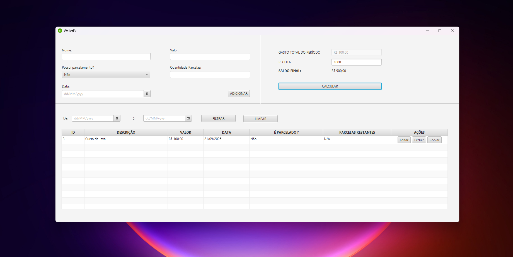

# WalletFX - Gerenciador de Despesas Financeiras

Este é o **WalletFX**, um aplicativo desktop que desenvolvi em **Java 21** com **JavaFX 21.0.2** para gerenciar minhas despesas financeiras pessoais. Ele me permitiu aplicar conceitos de **Clean Architecture, Java 21, JavaFX  e persistência em banco relacional com JDBC**.



----------

## O que meu projeto faz

-   Adiciona transações financeiras com:

    -   Nome

    -   Valor

    -   Data

    -   Parcelamento e quantidade de parcelas restantes

-   Permite editar e copiar transações existentes

-   Exclui transações com confirmação

-   Filtra transações por período

-   Calcula saldo final com base no orçamento informado

-   Atualiza a tabela e o total de transações dinamicamente

-   Possui validações e tratamento de exceções

-   Interface amigável com alertas visuais e formatação de valores


----------

## Tecnologias que usei

-   **Java 21**

-   **JavaFX 21.0.2**

-   **Maven** para gerenciamento de dependências e build

-   **SQLite** via JDBCD

-   **Clean Architecture** com camadas bem definidas:

    -   **domain**: entidades de negócio e exceções de domínio

    -   **application**: casos de uso, repositórios, exceções de regras de negócios e DTOs

    -   **infrastructure**: banco de dados e repositórios

    -   **presentation**: controllers JavaFX e exceções de validações

-   **Bindings e ObservableList** para atualizar a interface automaticamente

-   **Validações personalizadas** e mensagens de erro amigáveis


----------

## Estrutura do projeto

```
src/main/java/br/com/walletfx
├── application
│   ├── dtos
    ├── exceptions
│   ├── repositories
│   └── usecases
├── domain
│   └── entities
		├── exceptions
├── infrastructure
│   ├── database/
		|──── DatabaseConnection.java
		|──── Migrations.java
│   └── repositories
└── presentation
    ├── controllers
    └── exceptions
resources
└── br/com/walletfx/icons
└── br/com/walletfx/database/db.properties
└── br/com/walletfx/views

```

----------

## Como executar

1.  Clone o projeto:


```bash
git clone https://github.com/venanciomagalhaes/wallet-fx
cd wallet-fx

```

2.  Build com Maven:


```bash
mvn clean package

```

3.  Execute o projeto:


```bash
mvn javafx:run

```
Ainda é possível executar diretamente via .exe em sua máquina. Basta ter a variável
de ambiente JAVA_HOME adicionada ao PATH de sua máquina, utilizando Java 21 ou superior, e então executar o WalletFX.exe 
contido nesse repositório.


----------

## Como usar o WalletFX

-   **Adicionar transações:** Preencho Nome, Valor, Data e Parcelamento (opcional) e clico em _Salvar_.

-   **Editar transações:** Clico no botão _Editar_ na tabela.

-   **Copiar transações:** Clico em _Copiar_ para duplicar uma transação.

-   **Excluir transações:** Clico em _Excluir_ e confirmo.

-   **Filtrar por período:** Seleciono datas inicial e final e clico em _Filtrar_.

-   **Calcular saldo final:** Insiro meu orçamento e clico em _Calcular_ para ver quanto sobra.
    


